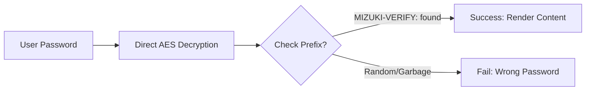

本博客模板基于 [Astro](https://astro.build/) 构建。本指南未提及的内容，你可以在 [Astro 文档](https://docs.astro.build/) 中找到答案。

## 文章的 Front-matter

```yaml
---
title: My First Blog Post
published: 2023-09-09
description: This is the first post of my new Astro blog.
image: ./cover.jpg
tags: [Foo, Bar]
category: Front-end
draft: false
---
```


| 属性     | 说明                                                                                                                                                                                                 |
|---------------|-------------------------------------------------------------------------------------------------------------------------------------------------------------------------------------------------------------|
| `title`       | 文章标题。                                                                                                                                                                                      |
| `published`   | 文章发布日期。                                                                                                                                                                            |
| `pinned`      | 该文章是否置顶到文章列表顶部。                                                                                                                                                   |
| `description` | 文章的简短描述。显示在首页。                                                                                                                                                   |
| `image`       | 文章封面图片路径。<br/>1. 以 `http://` 或 `https://` 开头：使用网络图片<br/>2. 以 `/` 开头：使用 `public` 目录中的图片<br/>3. 无以上前缀：相对于 markdown 文件 |
| `tags`        | 文章标签。                                                                                                                                                                                       |
| `category`    | 文章分类。                                                                                                                                                                                   |
| `alias`   | 文章的别名。文章可通过 `/posts/{alias}/` 访问。示例：`my-special-article`（可通过 `/posts/my-special-article/` 访问）                                   |
| `licenseName` | 文章内容的许可名称。                                                                                                                                                                      |
| `author`      | 文章作者。                                                                                                                                                                                     |
| `sourceLink`  | 文章内容的来源链接或参考。                                                                                                                                                          |
| `draft`       | 该文章是否为草稿（草稿不会显示）。                                                                                                                                                    |
| `encrypted`   | 该文章是否受密码保护。                                                                                                                                                                    |
| `password`    | 解锁加密文章的密码。                                                                                                                                                                  |
| `passwordHint`| 帮助用户记住密码的提示。显示在密码输入框下方。                                                                                                                             |
| `hideHomeContent` | 是否隐藏公开的文章摘要，包括首页、meta 标签、订阅/API 摘要和分享预览。设置 `password` 时默认为 `true`。                                      |

## 文章文件放置位置


你的文章文件应放在 `src/content/posts/` 目录中。你也可以创建子目录，以便更好地组织文章和资源。

```
src/content/posts/
├── post-1.md
└── post-2/
    ├── cover.png
    └── index.md
```

## 文章别名

你可以通过在 front-matter 中添加 `alias` 字段为任何文章设置别名：

```yaml
---
title: My Special Article
published: 2024-01-15
alias: "my-special-article"
tags: ["Example"]
category: "Technology"
---
```

设置别名后：
- 文章可通过自定义 URL 访问（例如 `/posts/my-special-article/`）
- 默认的 `/posts/{slug}/` URL 仍然可用
- RSS/Atom 订阅将使用自定义别名
- 所有内部链接将自动使用自定义别名

**重要说明：**
- 别名不应包含 `/posts/` 前缀（会自动添加）
- 别名中避免使用特殊字符和空格
- 为获得最佳 SEO 效果，请使用小写字母和连字符
- 确保所有文章的别名唯一
- 不要包含前导或尾随斜杠


## 工作原理



## 文章加密

你可以通过在 front-matter 中设置 `encrypted: true` 并提供 `password` 来为任何文章启用密码保护：

```yaml
---
title: My Private Post
published: 2024-01-15
encrypted: true
password: "my-secret-password"
passwordHint: "Hint: The password is my dog's name"
hideHomeContent: true
---
```

### 字段

| 字段          | 必需 | 说明                                              |
|----------------|----------|----------------------------------------------------------|
| `encrypted`    | 是      | 设为 `true` 以启用密码保护              |
| `password`     | 是      | 解锁文章的密码                          |
| `passwordHint` | 否       | 显示在密码输入框下方以帮助用户的提示 |
| `hideHomeContent` | 否   | 将公开摘要隐藏为 `该文章已加密`。设置 `password` 时默认为 `true`。设为 `false` 以显示正常摘要。 |

### 解锁框的外观

解锁框显示：
- 主题主色的锁图标
- 文章标题"受密码保护"
- 请求输入密码的描述
- 提示（如果提供了 `passwordHint`）
- 密码输入框和解锁按钮

输入正确密码后，内容将被解密并显示。密码存储在会话存储中，因此同一会话内后续页面加载时用户无需重新输入。
