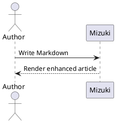
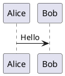

## GitHub 仓库卡片
你可以添加链接到 GitHub 仓库的动态卡片，页面加载时会从 GitHub API 拉取仓库信息。

::github{repo="LyraVoid/Mizuki"}

使用 `::github{repo="LyraVoid/Mizuki"}` 代码创建 GitHub 仓库卡片。

```markdown
::github{repo="LyraVoid/Mizuki"}
```

## 提示框（Admonitions）

支持以下类型的提示框：`note` `tip` `important` `warning` `caution`

:::note
突出显示用户即使略读也应关注的信息。
:::

:::tip
可选信息，帮助用户更成功。
:::

:::important
用户成功所必需的关键信息。
:::

:::warning
因潜在风险需要用户立即关注的关键内容。
:::

:::caution
某个行为的潜在负面后果。
:::

### 基本语法

```markdown
:::note
Highlights information that users should take into account, even when skimming.
:::

:::tip
Optional information to help a user be more successful.
:::
```

### 自定义标题

提示框的标题可以自定义。

:::note[MY CUSTOM TITLE]
This is a note with a custom title.
:::

```markdown
:::note[MY CUSTOM TITLE]
This is a note with a custom title.
:::
```

### GitHub 语法

> [!TIP]
> [GitHub 语法](https://github.com/orgs/community/discussions/16925) 也支持。

```
> [!NOTE]
> The GitHub syntax is also supported.

> [!TIP]
> The GitHub syntax is also supported.
```

### 剧透

你可以为文本添加剧透效果。文本同样支持 **Markdown** 语法。

The content :spoiler[is hidden **ayyy**]!

```markdown
The content :spoiler[is hidden **ayyy**]!
```

## 代码组

使用 VitePress 风格的 `::: code-group labels=[...]` 语法，将相关示例以可访问的标签页形式呈现。标签页支持鼠标输入以及
<kbd>Left</kbd>、<kbd>Right</kbd>、<kbd>Home</kbd> 和 <kbd>End</kbd> 键。

::: code-group labels=[TypeScript, Shell, Collapsed]

```ts title="config.ts" showLineNumbers {2} ins={3}
export const config = {
  framework: "Mizuki",
  enhanced: true,
};
```

```bash title="Build"
pnpm check && pnpm build
```

```js collapse={1-3}
import { one } from "one";
import { two } from "two";
import { three } from "three";
console.log(one, two, three);
```

:::

````markdown
::: code-group labels=[TypeScript, Shell]

```ts title="config.ts"
export const framework = "Mizuki";
```

```bash title="Build"
pnpm build
```

:::
````

### 自动折叠长代码

超过配置阈值的代码块会自动折叠。作者可以继续使用 `collapse={...}` 折叠选定的行范围。

```text
01
02
03
04
05
06
07
08
09
10
11
12
13
14
15
16
17
18
19
20
21
22
```

## 扩展提示框

除了 GitHub 的五个提醒类型外，Mizuki 还接受常见的 Obsidian
别名，如 `INFO`、`TODO`、`SUCCESS`、`QUESTION`、`DANGER`、`BUG`、
`EXAMPLE` 和 `QUOTE`。

> [!BUG] Known limitation
> Extended aliases are mapped to Mizuki's semantic callout styles.

同时支持 Python Markdown 和 Docusaurus 风格的指令：

:::danger[Danger directive]
This directive uses a custom title.
:::

```markdown
> [!BUG] Known limitation
> Describe the known issue here.

:::danger[Danger directive]
This directive uses a custom title.
:::
```

## Wiki 链接

Obsidian 风格的 Wiki 链接可解析文章路径、别名和标题锚点。
独立链接会变成文章卡片：

[[markdown-mermaid]]

行内链接保持行内显示。参见
[[markdown-mermaid|the Mermaid examples]]，或直接链接到
[[markdown-mermaid#Flowchart Example|a section]]。

```markdown
[[markdown-mermaid]]

See [[markdown-mermaid|the Mermaid examples]].
```

## 自动图片网格

两张或更多相邻的独立图片会自动分组为响应式画廊。
当需要自定义列数、宽高比或对象适配时，仍可使用显式的 `:::grid` 指令。


```markdown


```

## PlantUML

PlantUML 围栏通过配置的服务器生成 SVG 图表。图表
支持明暗主题、缩放、拖拽、重置和全屏
查看。



````markdown

````

## 化学公式

KaTeX 的 `mhchem` 扩展可渲染化学方程式：

$$
\ce{H2O + CO2 -> H2CO3}
$$
